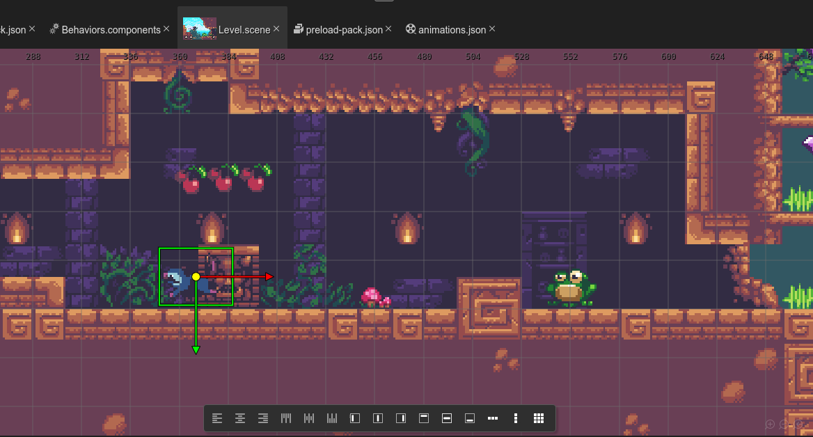

# Sunny Land, a Phaser Editor example game

This is a port to Phaser 3 of the [Sunny Land demo made by Luis Zuno](https://ansimuz.itch.io/sunny-land-pixel-game-art).

This is a good example of how to use the Tilemap support in the Scene Editor, the User Components and the Animations Editor.

## Configuration

* It is coded in JavaScript.
* It includes a VS Code project configuration (`jsconfig.json` file) and the type definitions (in the `types/` folder).

## Script Nodes

Script nodes are logic objects. You can add a script node to the scene or a game object, for extending it with custom data and behavior.

This project includes the script libraries:

- [@phaserjs/editor-scripts-core](https://github.com/phasedrjs/editor-scripts-core)